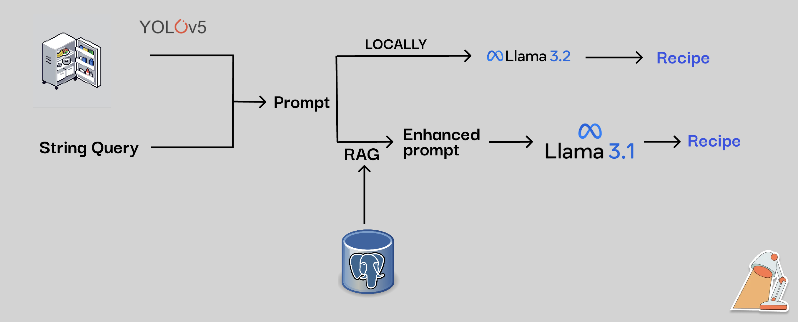
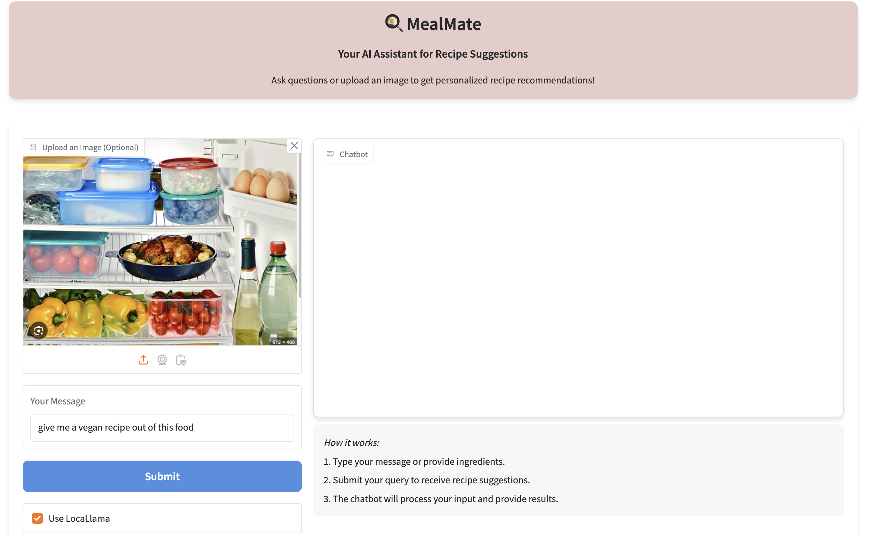
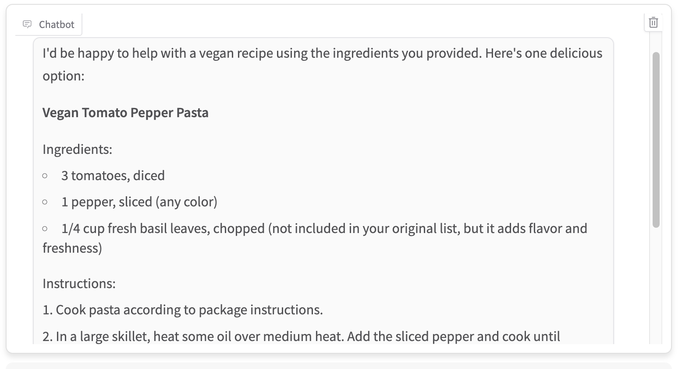

# MealMate 🍳

MealMate is an innovative application designed to analyze photos or descriptions of food ingredients, offering personalized recipes tailored to individual user preferences. It emphasizes health-conscious and budget-friendly options, making cooking both easy and enjoyable. The app includes the option to run locally using Llama3.2-3b enhancing accessibility and user safety.

---

## Pipeline Overview

The core of MealMate's functionality can be seen bellowe:



### 1. **Image or Text Input**
Users can either:
- Upload a photo of their ingredients.
- Provide a text description of available ingredients or specific instructions about the recipe we are looking for.

This input serves as the foundation for generating tailored recipe suggestions.

### 2. **Query Generation**
- If the user provides an image of food, it is processed through an object recognition model (YOLOv5, fine-tuned on a food detection dataset) to identify and count the ingredients.
- Prompt generation based on input:
  - If only an image is provided, the model generates a recipe from the identified ingredients.
  - If both image and text are provided, they are combined to form a detailed prompt.
  - If only text instructions are provided, the prompt is based solely on the text.
  - In all cases, a specific instruction is added to ensure the model only generates responses related to food or recipe descriptions, avoiding general-purpose conversations.

### 4. **Running the Query**
We offer the user two different ways to interact with the chat:
1. Connect to a RAG application running remotely on a Scaleway server, leveraging a knowledge base containing information from real datasets of recipes.
2. Enable interaction with Llama 3.2-3b running locally on the user's device. This avoids sending potentially sensitive data to an API, offers robustness against connectivity limitations, and leverages the advantages of edge computing.
3. Additionally, the app provides the user the ability to interact iteratively with the system to improve the compression of suggested recipes, ask for specific details, or even request new suggestions if the initial ones don't meet expectations, while further benefiting from the advantages of edge computing.
   
### 5. **Output and User Experience**
The final recipe is displayed to the user in a clean, intuitive format with options for further customization or additional suggestions.

---

## Features
- **Ingredient Recognition**: Accurately identify ingredients from photos or text inputs.
- **Personalized Recipes**: Generate recipes tailored to dietary needs and preferences, including health-conscious and budget-friendly options.
- **Optimized Experience**: User-friendly interface designed for seamless interaction using [gradio](https://www.gradio.app/)

---

## Future Enhancements
MealMate is a work in progress with ambitious plans for growth:
1. **Improved Ingredient Recognition**:
   - Expand the training dataset for the YOLO model to include a broader variety of food items.
2. **Platform Expansion**:
   - Develop compatibility with iOS and Android platforms for broader accessibility.
3. **Additional Features**:
   - Introduce more tailored recommendations, such as meal plans and cooking tips.
   - Add advanced filtering options for specific cuisines, allergies, or nutritional goals.

---

## Example of interaction:
In this case the user provide an image of the food in the fridge and ask for a vegan recipe:

- Input:

- Output:


## Demo video:

The following is a demostration video: [MealMate-Demo](https://drive.google.com/file/d/1XGPk7EdBovpzDkAAA8mPppz-15LHNB2m/view?usp=drive_link)

## Getting Started

1. Clone the repository:
   ```bash
   git clone https://github.com/Lucine1998/Recipe-Recommendation.git
   cd Recipe-Recommendation```
2. Install required packages:
   1. If using Conda:
   ```bash
   conda env create -f environment.yml
   2. otherwise:
   ```bash
   pip install requirements.txt
3. Enabling Llama 3.2-3b to run locally (via Ollama):
   1. Install Ollama based on your specific device: [Ollama Website](https://ollama.com/download)
   2. Pull the Llama 3.2-3b model:
   ```bash
   ollama pull llama3.2:3b
   3. Running ollama service
   ```bash
   ollama serve

## Acknowledgments

This work was completed as part of the following hackathon:

**Consumer AI Edge Hackathon** organized by:
- EntrepreneurFirst 
- Hugging Face 
- Meta-PyTorch   
- Scaleway 


        
